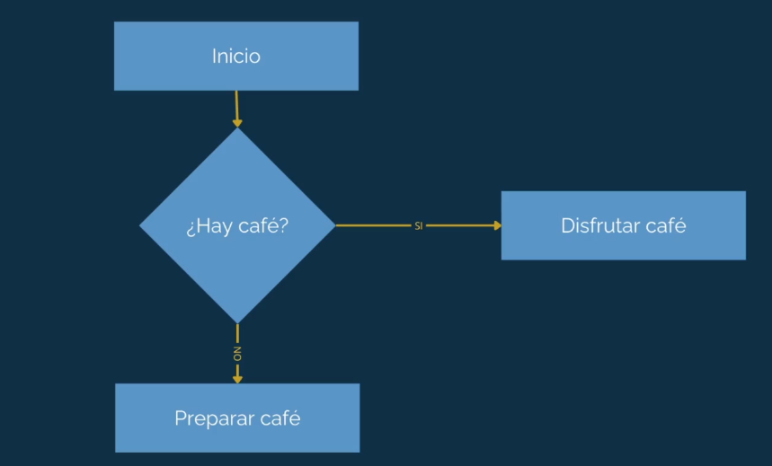
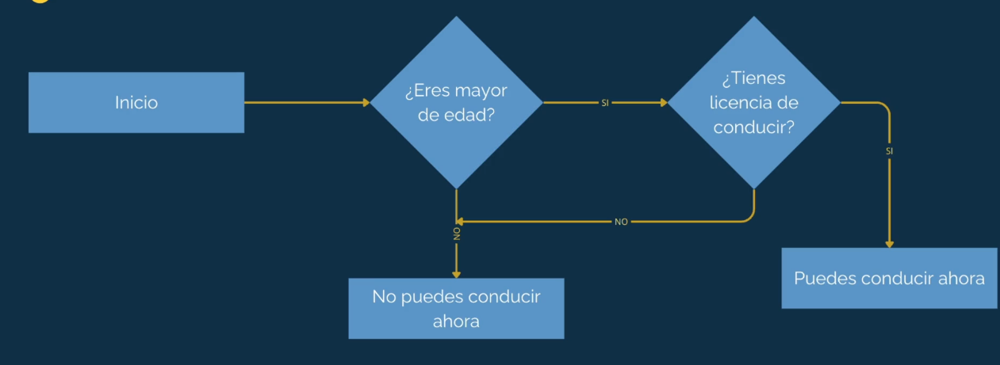

# ¿Qué es una condicional?

Es una forma en la que una computadora puede tomar decisiones.

## Ejemplo de toma de decisiones en la _vida cotidiana_:

- 'Si está lloviendo, llevo un paraguas.'
- 'Si hace frio, me pongo un suéter.'
- 'Si no hace frio ni llueve, salgo sin nada especial.'

¿Hay café?



¿Puedo conducir?



## Ejemplo de toma de decisiones en la _programación_:

- 'Si el usuario está autenticado, mostrar el dashboard.'
- 'Si el usuario no está autenticado, redirigir al login.'
- 'Si el usuario es admin, mostrar el dashboard de admin.'

En Python, las condicionales se implementan con la sentencia `if`.

## Sentencia `if` y `else`

Se utiliza para ejecutar un bloque de código si una condición es verdadera, y otro bloque si es falsa.

```python
is_old = True

if is_old:
    print('Puedes manejar')
else:
    print('Espero que cumplas 18')
```

## Sentencia `elif`

Se utiliza cuando queremos evaluar múltiples condiciones de forma secuencial.

```python
is_old = False
is_licenced = True

if is_old:
    print('Tienes edad para manejar')
elif is_licenced:
    print('Puedes manejar con tu licencia en la ciudad.')
else:
    print('Espera a cumplir la mayoria de edad o trámita tu licencia')
```

## Operador Ternario (If en una sola línea)

Es una forma concisa de escribir un `if-else`.

**Sintaxis:** `valor_si_true if condicion else valor_si_false`

```python
is_student = True
get_license = 'Licencia de estudiante' if is_student else 'Licencia normal'
```

> [!NOTE]
> Es muy similar al operador ternario en JavaScript (`condición ? true : false`), pero con una sintaxis más natural al lenguaje inglés.

## Valores Truthy y Falsey

En Python, no solo los booleanos `True` y `False` se evalúan en una condicional. Los valores que no son estrictamente booleanos pueden ser "veraces" (Truthy) o "falsos" (Falsey).

### Truthy (Valores que se evalúan como `True`)

Cualquier valor que no sea "vacío" o cero.

- Números diferentes a 0 (ej. `1`, `-1`, `123`, `1j`).
- Strings no vacíos (ej. `'hola'`).
- Colecciones no vacías (ej. `[1,2]`, `(3,4)`, `{5,6}`).

### Falsey (Valores que se evalúan como `False`)

- `False`
- `None`
- El número `0` y `0j`.
- Strings vacíos `''`.
- Colecciones vacías `[]`, `()`, `{}`.

```python
# Ejemplo
if [1,2,3]: # Esto es Truthy
    print("La lista no está vacía")

if '': # Esto es Falsey
    print("Esto no se imprimirá")
```

## None

`None` representa la ausencia de valor o un valor nulo en Python. Es similar a `null` en otros lenguajes de programación.

- `None` se evalúa como `False` en contextos booleanos.
- Se utiliza para indicar que una variable no tiene un valor asignado o que una función no devuelve nada.

```python
user = None

if user:
    print('Este usuario está registrado')
else:
    print('Usuario disponible')
```

## Operadores de Comparación

Los operadores de comparación se utilizan para comparar valores y devolver un booleano (`True` o `False`).

- `==` : Igualdad (compara si dos valores son iguales).
- `!=` : Desigualdad (compara si dos valores son diferentes).
- `>` : Mayor que.
- `<` : Menor que.
- `>=` : Mayor o igual que.
- `<=` : Menor o igual que.

```python
# Igualdad ==
print(5 == 5)  # True
print(5 == 3)  # False
print('hello' == 'hello')  # True

# Desigualdad !=
print(5 != 5)  # False
print(5 != 3)  # True
print('hello' != 'hello')  # False

# Mayor que >
print(5 > 4)  # True
print(2 > 4)  # False

# Menor que <
print(5 < 4)  # False
print(2 < 4)  # True
```

## Operadores Lógicos

Los operadores lógicos se utilizan para combinar expresiones booleanas.

- `and` : Devuelve `True` si ambas expresiones son `True`.
- `or` : Devuelve `True` si al menos una expresión es `True`.
- `not` : Niega el valor booleano (convierte `True` en `False` y viceversa).

```python
# and
print(True and True)   # True
print(True and False)  # False
print(False and True)  # False
print(False and False) # False

# or
print(True or True)    # True
print(True or False)   # True
print(False or True)   # True
print(False or False)  # False

# not
print(not True)  # False
print(not False) # True

# Ejemplo con and
age = 25
licensed = True
if age >= 18 and licensed:
    print('Puedes conducir')

# Ejemplo con or
is_student = False
membership = True
if is_student or membership:
    print('Obtienes un descuento especial')

# Ejemplo con not
is_admin = False
if not is_admin:
    print('Acceso denegado')
```

## Operadores de Membresía

Los operadores de membresía se utilizan para verificar si un elemento pertenece a una secuencia (como listas, tuplas, strings, etc.).

- `in` : Devuelve `True` si el elemento está en la secuencia.
- `not in` : Devuelve `True` si el elemento no está en la secuencia.

```python
fruits = ['Manzana', 'Banana', 'Fresa']
print('Fresa' in fruits)     # True
print('Uva' not in fruits)   # True
print('Mango' in fruits)     # False
print('Fresa' not in fruits) # False

sentence = 'Soy programador en JS, PHP...'
print('Python' in sentence)  # False (dependiendo del contenido)
```

Además, los operadores de membresía funcionan con otros objetos iterables, como `range()`.

La función `range()` genera una secuencia de números. Por defecto, comienza desde 0 y se detiene antes del número especificado. Por ejemplo, `range(1, 10)` genera números del 1 al 9 (no incluye el 10).

```python
print(10 in range(1, 10))  # False, porque range(1,10) es 1,2,3,4,5,6,7,8,9
```
